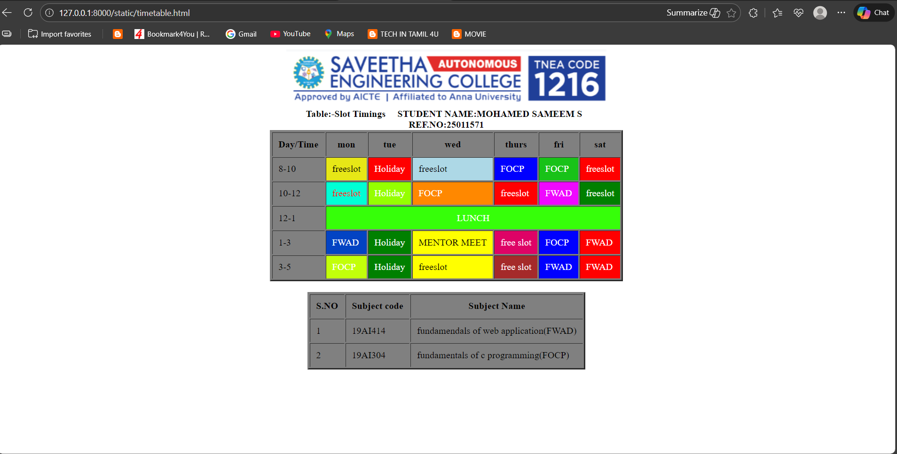

# Ex02 Time Table
# Date:05/12/2025
# AIM
To write a html webpage page to display your slot timetable.

# ALGORITHM
## STEP 1
Create a Django-admin Interface.

## STEP 2
Create a static folder and inert HTML code.

## STEP 3
Create a simple table using `<table>` tag in html.

## STEP 4
Add header row using `<th>` tag.

## STEP 5
Add your timetable using `<td>` tag.

## STEP 6
Execute the program using runserver command.

# PROGRAM
~~~
<html>      
    <head>
        <title>SLOT TIMINGS</title>
    </head>
    <body>    
        

         
        
   
        

        <table border="3" cellpadding="10" bgcolor="grey">
            <caption><b>Table:-Slot Timings &nbsp &nbsp STUDENT NAME:MOHAMED SAMEEM S &nbsp REF.NO:25011571</b></caption>
            <tr>
                <th>Day/Time</th>
                <th>mon</th>
                <th>tue</th>
                <th>wed</th>
                <th>thurs</th>
                <th>fri</th>
                <th>sat</th>
            </tr>
          <tr>
       <td class="time-col">8-10</td>
   <td style="background:rgb(231, 231, 22)">freeslot</td>
     <td style="background:red;color:#fff">Holiday</td>
       <td style="background:lightblue">freeslot</td>
          <td style="background:blue;color:#fff">FOCP</td>
           <td style="background:rgb(24, 194, 24);color:#fff">FOCP</td>
            <td style="background:red;color:#fff">freeslot</td>
      </tr>

 <tr>
      <td class="time-col">10-12</td>
        <td style="background:rgb(0, 255, 213);color:#ff0000">freeslot</td>
         <td style="background:rgb(149, 255, 0);color:#fff">Holiday</td>
               <td style="background:rgb(255, 136, 0);color:#fff">FOCP</td>
                 <td style="background:red;color:#fff">freeslot</td>
                <td style="background:rgb(239, 8, 255);color:#fff">FWAD</td>
                     <td style="background:green;color:#fff">freeslot</td>
         </tr>

        <tr>
           <td class="time-col">12-1</td>
         <td colspan="6" style="background:rgb(54, 255, 9);color:#fff">
LUNCH
</td>
            </tr>

           <tr>
         <td class="time-col">1-3</td>
           <td style="background:rgb(3, 67, 195);color:#fff">FWAD</td>
                 <td style="background:green;color:#fff">Holiday</td>
                         <td style="background:yellow">MENTOR MEET</td>
                          <td style="background:#de0366;color:#fff">free slot</td>
                              <td style="background:blue;color:#fff">FOCP</td>
                              <td style="background:red;color:#fff">FWAD</td>
        </tr>

         <tr>
                          <td class="time-col">3-5</td>
                    <td style="background:rgb(194, 255, 10);color:#fff">FOCP</td>
           <td style="background:green;color:#fff">Holiday</td>
                 <td style="background:yellow">freeslot</td>
               <td style="background:brown;color:#fff">free slot</td>
                       <td style="background:blue;color:#fff">FWAD</td>
                      <td style="background:red;color:#fff">FWAD</td>
             </tr>

            </tr>
        </table>

              &nbsp;
              &nbsp;
              &nbsp;
              &nbsp;
              &nbsp;

        

        <table border="3" cellpadding="10" bgcolor="grey">
            <tr>
                <th>S.NO</th>
                <th>Subject code</th>
                <th>Subject Name</th>
            </tr>
            <tr>
                <td>1</td>
                <td>19AI414</td>
                <td>fundamendals of web application(FWAD)</td>
            </tr>
        
        
            <tr>
                <td>2</td>
                <td>19AI304</td>
                <td>fundamentals of c programming(FOCP)</td>
            </tr>
        </table>
        

    </body>
</html>
~~~

# OUTPUT

# RESULT
The program for creating slot timetable using basic HTML tags is executed successfully.
